# Virtualized-Enterprise-Network-Lab

## Project Overview

This project documents the design and implementation of a secure, virtualized enterprise network infrastructure built in a classroom lab environment. The lab was centered around VMware ESXi 8 running on physical Intel NUC hardware and included Windows Server 2025, Cisco routing and switching, Active Directory, VLAN segmentation, centralized authentication, monitoring, vulnerability scanning, and security event collection.

The goal of this project was to simulate a real-world enterprise network by combining virtualization, network segmentation, identity management, secure administration, and cybersecurity monitoring tools into one complete infrastructure.

## Key Implementations

- Deployed **VMware ESXi 8** on physical Intel NUC hardware to host multiple virtual machines.
- Designed and configured a **multi-VLAN network** to separate classroom clients, virtual clients, servers, physical devices, parking lot ports, and DMZ traffic.
- Configured **Cisco Router 1941** and **Cisco Catalyst 2960-X Switch** with VLANs, trunking, Router-on-a-Stick (ROAS), SSH access, port security, ACLs, and OSPF routing.
- Installed and configured **Windows Server 2025** with DHCP, DNS, and Active Directory Domain Services.
- Built an **Active Directory environment** with multiple domain controllers, organizational units, user accounts, group policies, and PowerShell-based user provisioning.
- Implemented **RADIUS authentication** using Microsoft Network Policy Server (NPS) for centralized login control to Cisco network devices.
- Created a **DMZ VLAN** hosting a CentOS-based web server secured with HTTPS using a self-signed certificate.
- Deployed additional enterprise and cybersecurity services including **Docker, Nagios, OpenVAS, WordPress, and Wazuh**.

## Technologies Used

- VMware ESXi 8
- Windows Server 2025
- Active Directory Domain Services
- DHCP / DNS
- Cisco IOS
- VLANs / Trunking
- Router-on-a-Stick (ROAS)
- OSPF
- ACLs
- SSH
- RADIUS / Microsoft NPS
- PowerShell
- CentOS / Ubuntu Linux
- Docker
- Nagios
- OpenVAS
- WordPress
- Wazuh

## Skills Demonstrated

- Network design and segmentation
- Cisco router and switch configuration
- Virtualization and server deployment
- Windows Server administration
- Active Directory identity management
- DHCP and DNS configuration
- PowerShell automation
- Secure remote administration
- RADIUS authentication and role-based access control
- DMZ design and access control
- Vulnerability scanning and infrastructure monitoring
- SIEM/log monitoring with Wazuh
- Technical documentation and troubleshooting

## Project Scope

This repository is a portfolio version of my CYB242 Capstone project. The original class report included detailed documentation, configuration evidence, validation screenshots, and troubleshooting notes. This GitHub version summarizes the project in a cleaner format for professional portfolio use.

Sensitive information such as passwords, shared secrets, internal credentials, and full configuration details have been removed or sanitized.

## Network Diagram 
  

## Network Architecture
### Phase 1 – Virtualization & Base Infrastructure
Installed VMware ESXi 8 on Intel NUC hardware
Created Windows Server 2025 VM
Configured static IPs and DHCP foundation

<b>Click to view evidence</b>

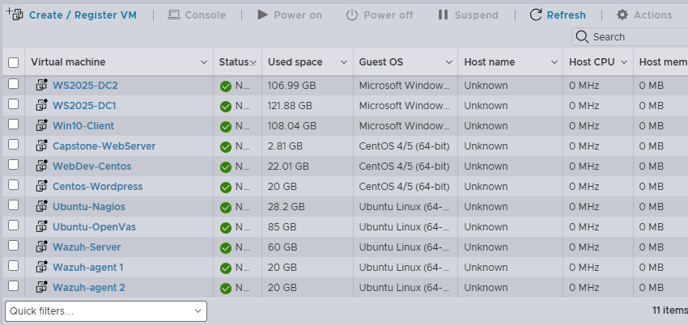

### Phase 2 – VLAN Segmentation & Routing

Created multiple VLANs for clients, servers, physical devices, parking lot, and DMZ
Configured Cisco switch trunks and router-on-a-stick
Enabled inter-VLAN routing

<b>Vlan mapping table</b>

  VLAN ID 	Name 	Description 	Subnet 
10 	Classroom Clients 	Physical lab workstations 	10.115.10.0/24 
20 	Virtual Clients 	VM acting as end-user (Windows 10) 	10.115.20.0/24 
30 	Virtual Servers 	Infrastructure servers (Windows server 2025)  	10.115.30.0/24 
40 	Physical devices  	Switch, Router, and ESXi Management 	10.115.40.0/24 
50 	Parking lot 	Disabled/Unused ports for security 	10.115.50.0/24 
99 	DMZ 	Isolated external-facing zone 	10.115.99.0/24 

<b>Click to view evidence</b>

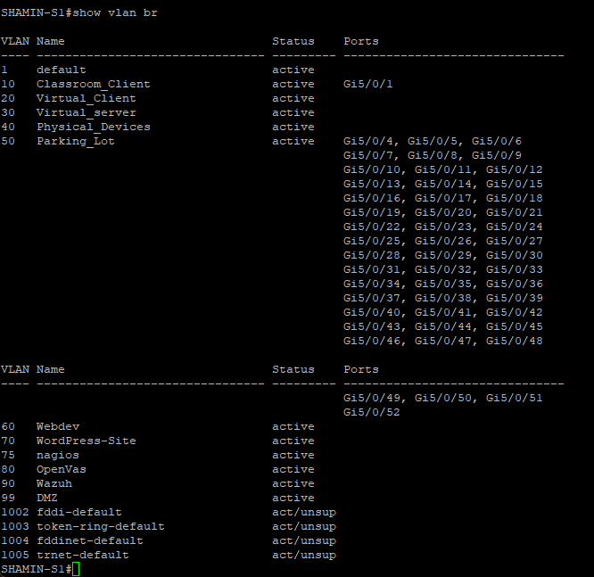
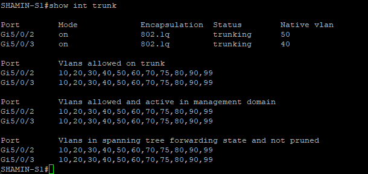
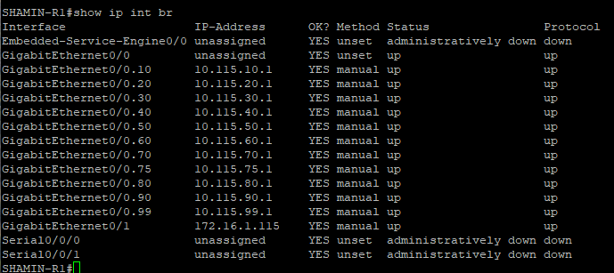

### Phase 3 – Secure Network Device Management
Configured SSH on router and switch
Secured unused ports
Created management access to devices

<b>Click to view evidence</b>

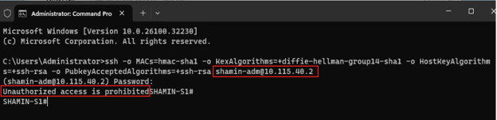
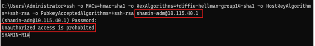

### Phase 4 – Active Directory & Windows Server Services
Installed AD DS
Created domain/forest
Added second domain controller
Configured DNS, DHCP, OUs, GPOs
Used PowerShell + CSV for bulk user creation

<b>Click to view evidence</b>

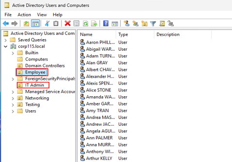
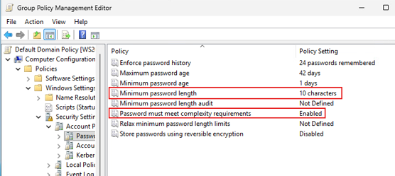
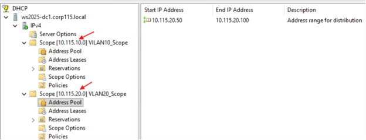
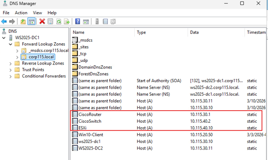

### Phase 5 – RADIUS / NPS Authentication
Installed NPS on second domain controller
Added router and switch as RADIUS clients
Created policies for Network Engineers and Network Techs
Used Cisco privilege levels for full vs read-only access

<b>Click to view evidence</b>

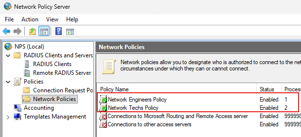
  

