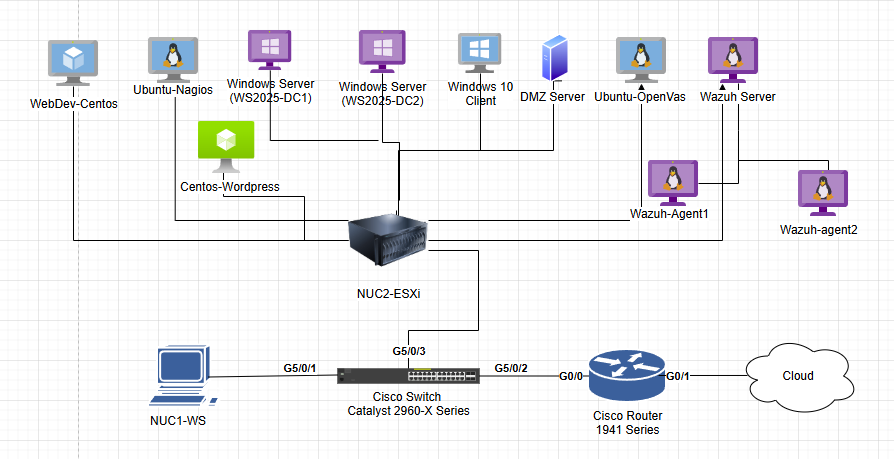

# Virtualized-Enterprise-Network-Lab

## Project Overview

This project documents the design and implementation of a secure, virtualized enterprise network infrastructure built in a classroom lab environment. The lab was centered around VMware ESXi 8 running on physical Intel NUC hardware and included Windows Server 2025, Cisco routing and switching, Active Directory, VLAN segmentation, centralized authentication, monitoring, vulnerability scanning, and security event collection.

The goal of this project was to simulate a real-world enterprise network by combining virtualization, network segmentation, identity management, secure administration, and cybersecurity monitoring tools into one complete infrastructure.

## Key Implementations

- Deployed **VMware ESXi 8** on physical Intel NUC hardware to host multiple virtual machines.
- Designed and configured a **multi-VLAN network** to separate classroom clients, virtual clients, servers, physical devices, parking lot ports, and DMZ traffic.
- Configured **Cisco Router 1941** and **Cisco Catalyst 2960-X Switch** with VLANs, trunking, Router-on-a-Stick (ROAS), SSH access, port security, ACLs, and OSPF routing.
- Installed and configured **Windows Server 2025** with DHCP, DNS, and Active Directory Domain Services.
- Built an **Active Directory environment** with multiple domain controllers, organizational units, user accounts, group policies, and PowerShell-based user provisioning.
- Implemented **RADIUS authentication** using Microsoft Network Policy Server (NPS) for centralized login control to Cisco network devices.
- Created a **DMZ VLAN** hosting a CentOS-based web server secured with HTTPS using a self-signed certificate.
- Deployed additional enterprise and cybersecurity services including **Docker, Nagios, OpenVAS, WordPress, and Wazuh**.

## Technologies Used

- VMware ESXi 8
- Windows Server 2025
- Active Directory Domain Services
- DHCP / DNS
- Cisco IOS
- VLANs / Trunking
- Router-on-a-Stick (ROAS)
- OSPF
- ACLs
- SSH
- RADIUS / Microsoft NPS
- PowerShell
- CentOS / Ubuntu Linux
- Docker
- Nagios
- OpenVAS
- WordPress
- Wazuh

## Skills Demonstrated

- Network design and segmentation
- Cisco router and switch configuration
- Virtualization and server deployment
- Windows Server administration
- Active Directory identity management
- DHCP and DNS configuration
- PowerShell automation
- Secure remote administration
- RADIUS authentication and role-based access control
- DMZ design and access control
- Vulnerability scanning and infrastructure monitoring
- SIEM/log monitoring with Wazuh
- Technical documentation and troubleshooting

## Project Scope

This repository is a portfolio version of my CYB242 Capstone project. The original class report included detailed documentation, configuration evidence, validation screenshots, and troubleshooting notes. This GitHub version summarizes the project in a cleaner format for professional portfolio use.

Sensitive information such as passwords, shared secrets, internal credentials, and full configuration details have been removed or sanitized.

## Network Diagram 
  

### Network Architecture

