# Virtualized-Enterprise-Network-Lab

## Project Overview

This project documents the design and implementation of a secure, virtualized enterprise network infrastructure built in a classroom lab environment. The lab was centered around VMware ESXi 8 running on physical Intel NUC hardware and included Windows Server 2025, Cisco routing and switching, Active Directory, VLAN segmentation, centralized authentication, monitoring, vulnerability scanning, and security event collection.

The goal of this project was to simulate a real-world enterprise network by combining virtualization, network segmentation, identity management, secure administration, and cybersecurity monitoring tools into one complete infrastructure.

## Key Implementations

- Deployed **VMware ESXi 8** on physical Intel NUC hardware to host multiple virtual machines.
- Designed and configured a **multi-VLAN network** to separate classroom clients, virtual clients, servers, physical devices, parking lot ports, and DMZ traffic.
- Configured **Cisco Router 1941** and **Cisco Catalyst 2960-X Switch** with VLANs, trunking, Router-on-a-Stick (ROAS), SSH access, port security, ACLs, and OSPF routing.
- Installed and configured **Windows Server 2025** with DHCP, DNS, and Active Directory Domain Services.
- Built an **Active Directory environment** with multiple domain controllers, organizational units, user accounts, group policies, and PowerShell-based user provisioning.
- Implemented **RADIUS authentication** using Microsoft Network Policy Server (NPS) for centralized login control to Cisco network devices.
- Created a **DMZ VLAN** hosting a CentOS-based web server secured with HTTPS using a self-signed certificate.
- Deployed additional enterprise and cybersecurity services including **Docker, Nagios, OpenVAS, WordPress, and Wazuh**.

## Technologies Used

- VMware ESXi 8
- Windows Server 2025
- Active Directory Domain Services
- DHCP / DNS
- Cisco IOS
- VLANs / Trunking
- Router-on-a-Stick (ROAS)
- OSPF
- ACLs
- SSH
- RADIUS / Microsoft NPS
- PowerShell
- CentOS / Ubuntu Linux
- Docker
- Nagios
- OpenVAS
- WordPress
- Wazuh

## Skills Demonstrated

- Network design and segmentation
- Cisco router and switch configuration
- Virtualization and server deployment
- Windows Server administration
- Active Directory identity management
- DHCP and DNS configuration
- PowerShell automation
- Secure remote administration
- RADIUS authentication and role-based access control
- DMZ design and access control
- Vulnerability scanning and infrastructure monitoring
- SIEM/log monitoring with Wazuh
- Technical documentation and troubleshooting

## Project Scope & Documentation

This repository serves as a comprehensive portfolio representation of an enterprise-grade virtualized network lab built on physical Intel NUC host hardware and Cisco enterprise equipment. The original report included detailed documentation, configuration evidence, validation screenshots, and troubleshooting notes.
📄 **[View Full Technical Documentation (PDF)](Documentation/CYB242_Capstone_Full_Lab_Report.pdf)**

>**Note:** Sensitive information such as passwords, shared secrets, internal credentials, and full configuration details have been removed or sanitized.

## Rack Setup

*Physical Hardware: Cisco 1941 Router, Catalyst 2960-X Switch, and Intel NUC ESXi Host.*
## Network Diagram 
  
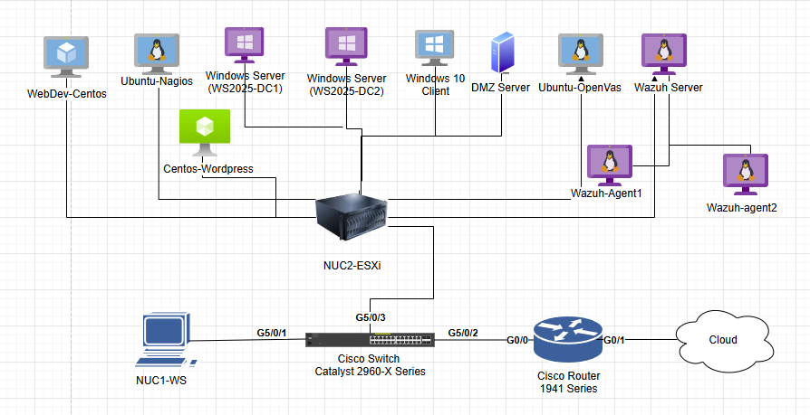

 
## Network Table

| Device | Type | VLAN | IP Address | Subnet Mask | Default Gateway |
| --- | --- | --- | --- | --- | --- |
| NUC1-WS | Physical | 10 | 10.115.10.20 (DHCP later) | 255.255.255.0 | 10.115.10.1 |
| Cisco Router 1941 Series | Physical | 10/20/30/40/50 | 10.115.10.1 / 10.115.20.1 / 10.115.30.1 / 10.115.40.1 / 10.115.50.1 | 255.255.255.0 | |
| Switch Catalyst 2960-X Series | Physical | 40 | 10.115.40.2 | 255.255.255.0 | 10.115.40.1 |
| NUC2-ESXi | Physical | 40 | 10.115.40.10 | 255.255.255.0 | 10.115.40.1 |
| WS2025-DC1 | VM | 30 | 10.115.30.10 | 255.255.255.0 | 10.115.30.1 |
| WS2025-DC2 | VM | 30 | 10.115.30.11 | 255.255.255.0 | 10.115.30.1 |
| Win10-Client | VM | 20 | 10.115.20.10 (DHCP later) | 255.255.255.0 | 10.115.20.1 |
| TS-SWITCH-LINK | Physical | | 172.16.1.115 (router port) | 255.255.255.0 | |
| DMZ Server | VM | 99 | 10.115.99.99 | 255.255.255.0 | 10.115.99.1 |
| WebDev-Centos | VM | 30 | 10.115.30.15 | 255.255.255.0 | 10.115.30.1 |
| Centos-Wordpress | VM | 30 | 10.115.30.20 | 255.255.255.0 | 10.115.30.1 |
| Ubuntu-Nagios | VM | 30 | 10.115.30.25 | 255.255.255.0 | 10.115.30.1 |
| Ubuntu-OpenVas | VM | 30 | 10.115.30.30 | 255.255.255.0 | 10.115.30.1 |
| Wazuh Server | VM | 30 | 10.115.30.35 | 255.255.255.0 | 10.115.30.1 |
| Wazuh-agent1 | VM | 30 | 10.115.30.40 | 255.255.255.0 | 10.115.30.1 |
| Wazuh-agent2 | VM | 30 | 10.115.30.45 | 255.255.255.0 | 10.115.30.1 |

## Network Architecture
### Phase 1 – Virtualization & Base Infrastructure
- Installed VMware ESXi 8 on Intel NUC hardware
- Created Windows Server 2025 VM
- Configured static IPs and DHCP foundation

<b>View ESXi Host & Virtual Machine Provisioning Evidence</b>

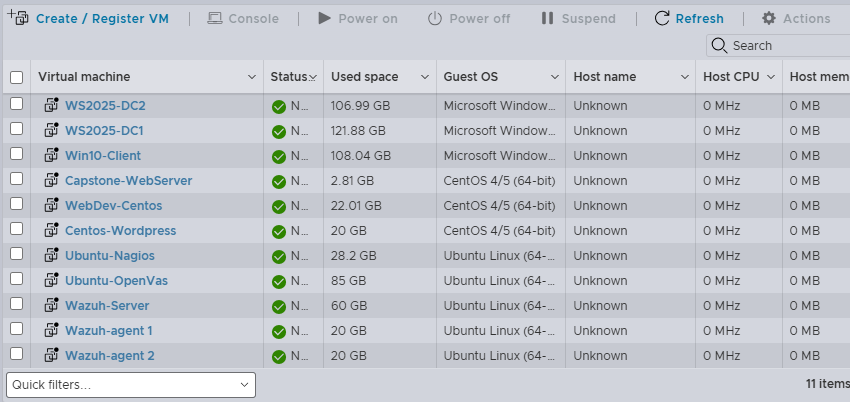

### Phase 2 – VLAN Segmentation & Routing

- Created multiple VLANs for clients, servers, physical devices, parking lot, and DMZ
- Configured Cisco switch trunks and router-on-a-stick
- Enabled inter-VLAN routing
  
#### Vlan mapping table
  
 | VLAN ID | Name | Description | Subnet |
| --- | --- | --- | --- |
| 10 | Classroom Clients | Physical lab workstations | 10.115.10.0/24 |
| 20 | Virtual Clients | VM acting as end-user (Windows 10) | 10.115.20.0/24 |
| 30 | Virtual Servers | Infrastructure servers (Windows server 2025) | 10.115.30.0/24 |
| 40 | Physical devices | Switch, Router, and ESXi Management | 10.115.40.0/24 |
| 50 | Parking lot | Disabled/Unused ports for security | 10.115.50.0/24 |
| 99 | DMZ | Isolated external-facing zone | 10.115.99.0/24 |

<b>View Switch VLAN, Trunking & Subinterface Configuration Evidence</b>

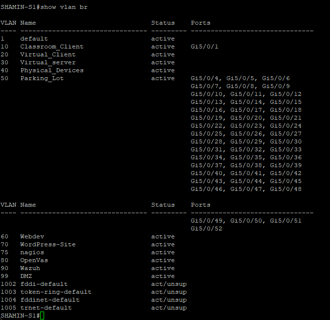
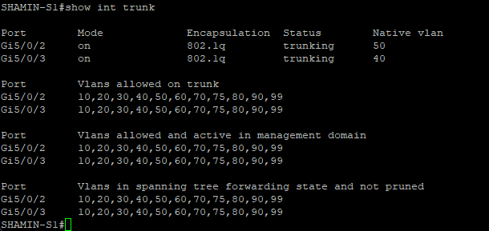
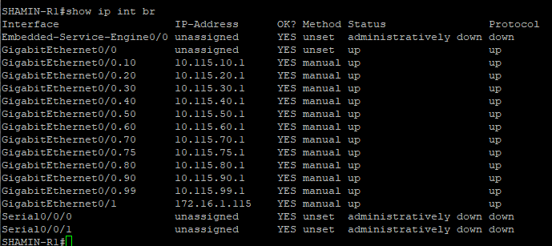

### Phase 3 – Secure Network Device Management
- Configured SSH on router and switch
- Secured unused ports
- Created management access to devices

<b>View SSH, Port Security & Device Hardening Evidence</b>

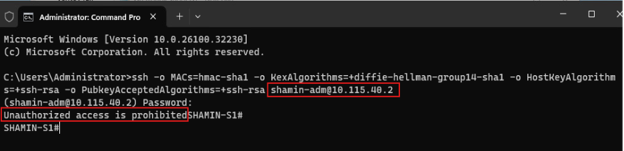
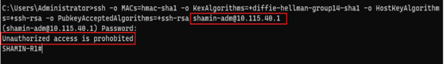

### Phase 4 – Active Directory & Windows Server Services
- Installed AD DS
- Created domain/forest
- Added second domain controller
- Configured DNS, DHCP, OUs, GPOs
- Used PowerShell + CSV for bulk user creation

<b>View Active Directory Domain Controller services Evidence</b>

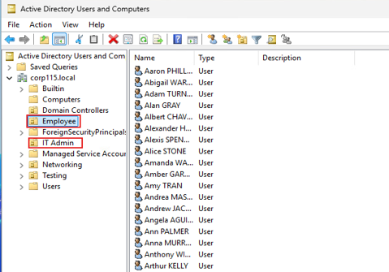
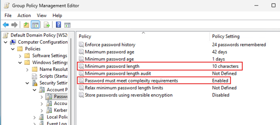
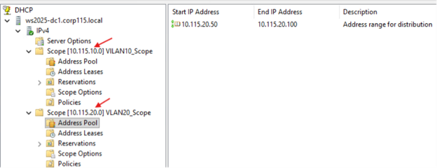
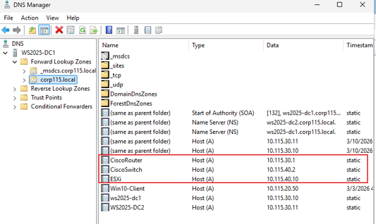

### Phase 5 – RADIUS / NPS Authentication
- Installed NPS on second domain controller
- Added router and switch as RADIUS clients
- Created policies for Network Engineers and Network Techs
- Used Cisco privilege levels for full vs read-only access

<b>View RADIUS NPS Evidence</b>

  
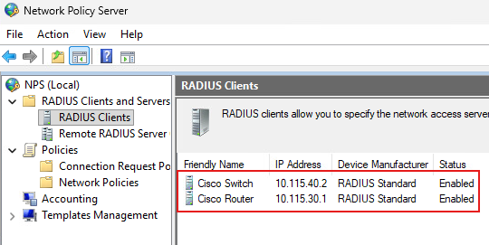
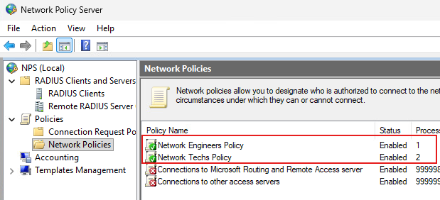

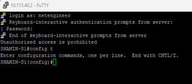
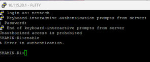
  

### Phase 6 – DMZ, OSPF, ACLs
- Created VLAN 99 DMZ
- Imported CentOS web server appliance
- Hosted custom HTTPS website
- Configured OSPF Area 0
- Used ACLs to restrict access

<b>View DMZ, OSPF, ACLs configuration</b>

  
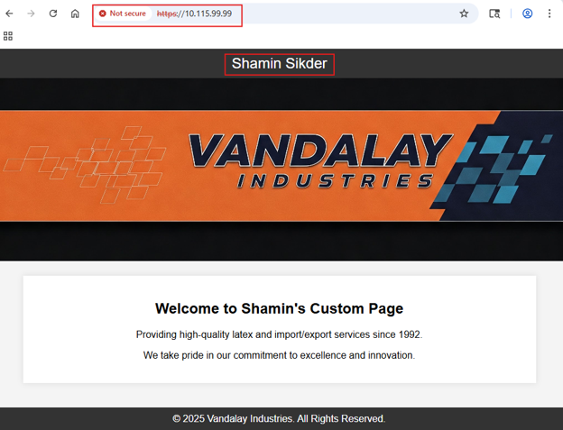
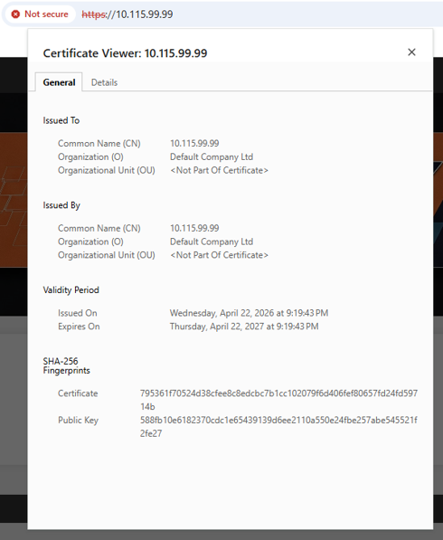
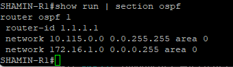
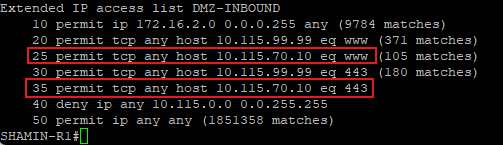
  

### Phase 7 – Additional Enterprise/Security Services
- Docker web server
- Nagios monitoring
- OpenVAS vulnerability scanning
- WordPress hosting
- Wazuh SIEM/log monitoring with agents

<b>View Web Server, SIEM Log Monitoring & OpenVAS Scan Evidence</b>

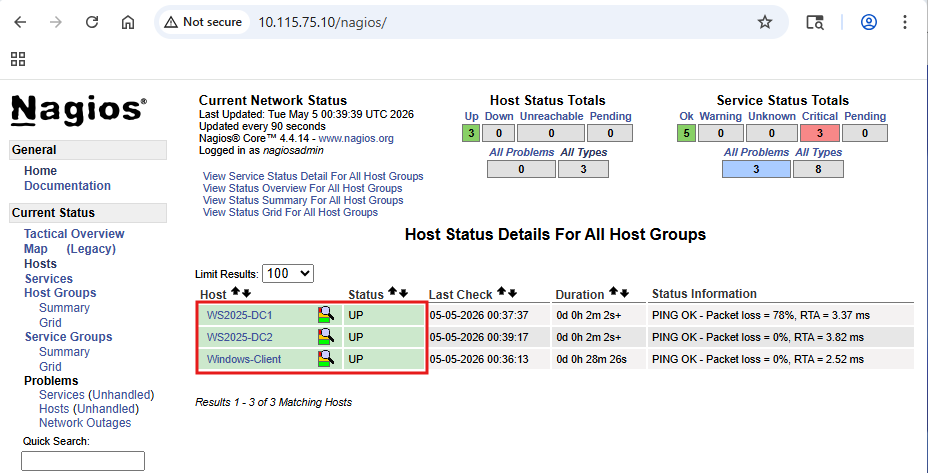
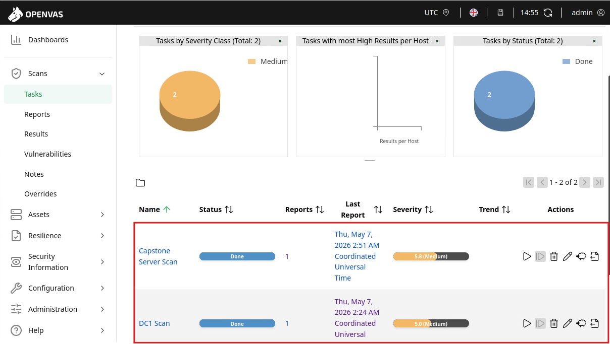
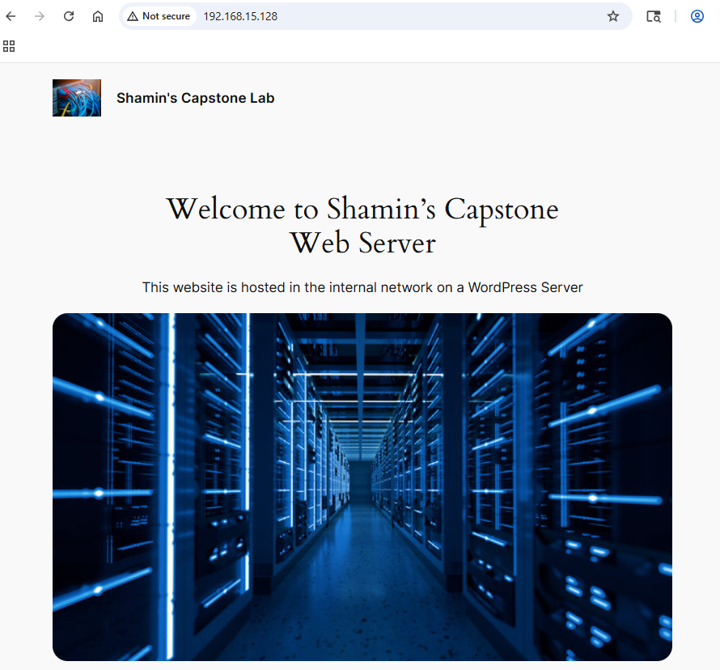

